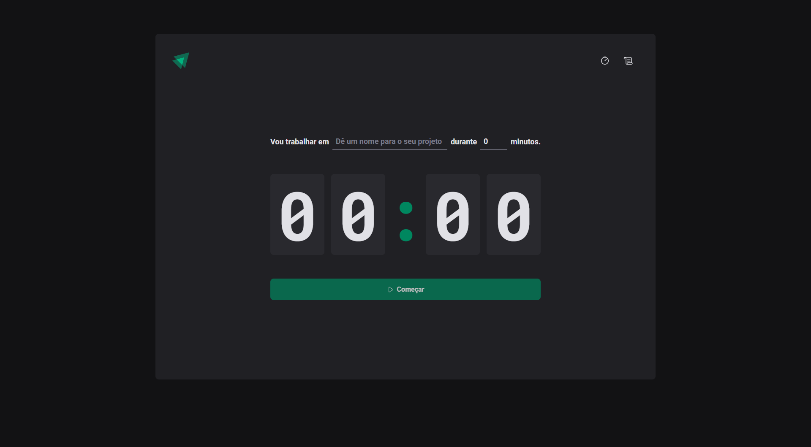
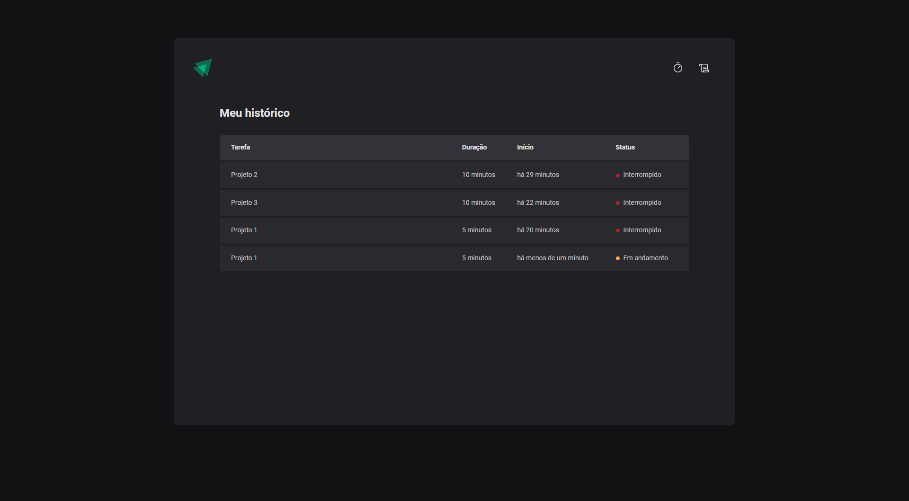

<a id="-screenshot"></a>

## Pomodoro Timer




&nbsp;
<a id="-sobre-o-projeto"></a>

## 💻 Sobre o Projeto

🚀 Projeto Pomodoro para administração de tempo.


&nbsp;
<a id="-funcionalidade"></a>

## 📋 Funcionalidade

Possui as funcionalidades de:

- [x] Cria um timer conforme descrito no formulário;
- [x] Cria uma tabela com status do andamento daquele item;
- [x] Tem uma página de histórico;
- [x] Validação do formulário;
- [x] Armazenamento de dados da aplicação localmente;


&nbsp;
<a id="-tecnologias"></a>

## 🛠 Tecnologias

As seguintes ferramentas foram usadas na construção do projeto

- ViteJs
- ReactJs
- TypeScript
- Styled Components
- React Hook Form
- Zod
- Immer
- Date Fns


&nbsp;
<a id="-instalação"></a>

## ⚙️ Instalações


### FRONT-END | ViteJs - ReactJs - TypeScript

Cria um projeto com ViteJs

```bash
npm create vite@latest
# Project name: » web | Select a framework: » React | Select a variant: » TypeScript
npm install
```

### Executando o aplicativo web

```bash
cd web
npm run dev
```

##### _#CompartilheConhecimento_
